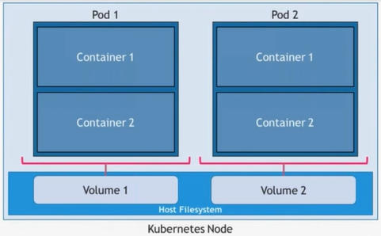
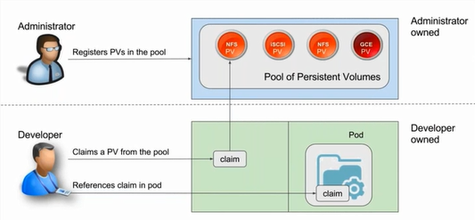

# Dealing with Storage and Persistence

## Objectives
- Adding persistence to Pods
- Dealing with block storage in the cloud
- Understanding Persistence Volumes and Claims
- Demos
---
## Persistence in the Pods
- Pods are ephemeral and stateless
- Volumes bring persistence to Pods
- Kubernetes volumes are similar to Docker volumes, but managed differently
- All containers in a Pod can access the volume
- Volumes are associated with the lifecycle of Pod
- Directories in the host are exposed as volumes
- Volumes may be based on a variety of storage backends
## Pods and Volumes



With storage back-end
## Kubernetes Volumes Types
- **Host-based**
	- EmptyDir
	- HostPath
- **Block Storage**
	- Amazon EBS
	- GCE Persistent Disk
	- Azure Disk
	- vSphere Volume
	- ...
- **Distributed File System**
	- NFS 
	- Ceph
	- Gluster
	- Amazon EFS
	- Azure File System
	- ...
- **Other**
	- Flocker
	- iScsi
	- Git Repo
	- Quobyte
	- ...
## Demo
### Host-based Volumes Block Storage-based Volumes
```console
$ kubectl create -f pod-vol-local.yaml
pod "nginx" created
$ kubectl get po
NAME      READY     STATUS    RESTARTS   AGE
nginx     1/1       Running   0          2m
```
Let's have a look at the newly created nginx pod created
```console
λ kubectl describe po nginx
Name:         nginx
Namespace:    default
Node:         minikube/192.168.99.100
Start Time:   Tue, 12 Dec 2017 14:57:23 +0800
Labels:       env=dev
Annotations:  <none>
Status:       Running
IP:           172.17.0.4
Containers:
  nginx:
    Container ID:   docker://8b2bf6e1a049d92da7ea1dd8769ca230c8b386b9bd0d5517f72a9809ac720b93
    Image:          nginx
    Image ID:       docker-pullable://nginx@sha256:d2b543f6f358a592c42f2085ae69fba138fd1a9da2c15806611145b22bcfd7ab
    Port:           80/TCP
    State:          Running
      Started:      Tue, 12 Dec 2017 14:57:42 +0800
    Ready:          True
    Restart Count:  0
    Environment:    <none>
    Mounts:
      /usr/share/nginx/html from my-vol (rw)
      /var/run/secrets/kubernetes.io/serviceaccount from default-token-zk79b (ro)
Conditions:
  Type           Status
  Initialized    True
  Ready          True
  PodScheduled   True
Volumes:
  my-vol:
    Type:  HostPath (bare host directory volume)
    Path:  /var/lib/my-data
  default-token-zk79b:
    Type:        Secret (a volume populated by a Secret)
    SecretName:  default-token-zk79b
    Optional:    false
QoS Class:       BestEffort
Node-Selectors:  <none>
Tolerations:     <none>
Events:
  Type    Reason                 Age   From               Message
  ----    ------                 ----  ----               -------
  Normal  Scheduled              3m    default-scheduler  Successfully assigned nginx to minikube

  Normal  SuccessfulMountVolume  3m    kubelet, minikube  MountVolume.SetUp succeeded for volume "my-vol"
  Normal  SuccessfulMountVolume  3m    kubelet, minikube  MountVolume.SetUp succeeded for volume "default-token-zk79b"
  Normal  Pulling                3m    kubelet, minikube  pulling image "nginx"
  Normal  Pulled                 2m    kubelet, minikube  Successfully pulled image "nginx"
  Normal  Created                2m    kubelet, minikube  Created container
  Normal  Started                2m    kubelet, minikube  Started container
```
Now, that we know that the nginx pod was created, let's see if the directory in question is accessible.
```console
$ minikube ssh
                         _             _
            _         _ ( )           ( )
  ___ ___  (_)  ___  (_)| |/')  _   _ | |_      __
/' _ ` _ `\| |/' _ `\| || , <  ( ) ( )| '_`\  /'__`\
| ( ) ( ) || || ( ) || || |\`\ | (_) || |_) )(  ___/
(_) (_) (_)(_)(_) (_)(_)(_) (_)`\___/'(_,__/'`\____)

$ ls -al /var/lib/my-data
total 0
drwxr-xr-x  2 root root 0 Dec 12 06:57 .
drwxr-xr-x 16 root root 0 Dec 12 06:57 ..
$
```
We are going to create a html file from /var/lib/my-data
```console
$ echo "Hello from host" > /var/lib/my-data/index.html 
$ cat /var/lib/my-data/index.html 
$ Hello from host
```
We will test to see if the file is persistent and while we delete the pod!
```console
$ kubectl delete -f pod-vol-local.yaml
pod "nginx" deleted
```
I'm back on the minikube console, where I'll test to see if the index.html file still exists on /var/lib/my-data/.
```console
$ ls -al /var/lib/my-data
total 4
drwxr-xr-x  2 root root  0 Dec 12 07:18 .
drwxr-xr-x 16 root root  0 Dec 12 06:57 ..
-rw-r--r--  1 root root 12 Dec 12 07:18 index.html
$ cat /var/lib/my-data/index.html
Hello from host
$ 
```
## Understanding Persistent Volumes & Claims
- PersistentVolume(PV)
	- Networked storage in the cluster pre-provisioned by an administrator
- PersistentVolumeClaim (PVC)
	- Storageresource requested by a user
- StorageClass
	- Types of supported storage profiles offered by administrators
## Storage Provisioning Workflow


Lifecycle of a Presistent Volume
- Provisioning
- Binding
- Using
- Releasing
- Reclaiming
## Demo
### Provisioning and Claiming NFS-based Volumes
```console
$ kubectl create -f my-pv.yaml
persistentvolume "my-pv" created
$ kubectl get pv
NAME      CAPACITY   ACCESS MODES   RECLAIM POLICY   STATUS      CLAIM     STORAGECLASS   REASON
   AGE
my-pv     1Gi        RWO            Recycle          Available
   5m
```
Let's have a different view of the Presistent Volume
```console
$ kubectl describe pv
Name:            my-pv
Labels:          type=local
Annotations:     <none>
StorageClass:
Status:          Available
Claim:
Reclaim Policy:  Recycle
Access Modes:    RWO
Capacity:        1Gi
Message:
Source:
    Type:      NFS (an NFS mount that lasts the lifetime of a pod)
    Server:    192.168.99.101
    Path:      /opt/data/web
    ReadOnly:  false
Events:        <none>
```
Let's create the PresistentVolumeClaim
```console
$ kubectl create -f my-pvc.yaml
persistentvolumeclaim "my-pvc" created
```
View the PersistentVolumeClaim 
```console
$ kubectl get pvc
NAME      STATUS    VOLUME                                     CAPACITY   ACCESS MODES   STORAGECLASS   AGE
my-pvc    Bound     my-pvc   1Gi        RWO            standard
       22s

```
Describe the PersistentVolumeClaim
```console
$ kubectl describe pvc
Name:          my-pvc
Namespace:     default
StorageClass:  standard
Status:        Bound
Volume:        my-pvc
Labels:        <none>
Annotations:   control-plane.alpha.kubernetes.io/leader={"holderIdentity":"84f8e527-dece-11e7-9a8e-08002720cfab","leaseDurationSeconds":15,"acquireTime":"2017-12-12T11:19:23Z","renewTime":"2017-12-12T11:19:25Z","lea...
               pv.kubernetes.io/bind-completed=yes
               pv.kubernetes.io/bound-by-controller=yes
               volume.beta.kubernetes.io/storage-provisioner=k8s.io/minikube-hostpath
Capacity:      1Gi
Access Modes:  RWO
Events:
  Type    Reason                 Age                From
                  Message
  ----    ------                 ----               ----
                  -------
  Normal  ExternalProvisioning   40s (x2 over 40s)  persistentvolume-controller
                  waiting for a volume to be created, either by external provisioner "k8s.io/minikube-hostpath" or manually created by system administrator
  Normal  Provisioning           40s                k8s.io/minikube-hostpath 84f8e527-dece-11e7-9a8e-08002720cfab  External provisioner is provisioning volume for claim "default/my-pvc"
  Normal  ProvisioningSucceeded  40s                k8s.io/minikube-hostpath 84f8e527-dece-11e7-9a8e-08002720cfab  Successfully provisioned volume pvc-4e6e2a5e-df2e-11e7-9056-08002720cfab
```
The PersistentVolume and PersistentVolumeClaim are created, it's time to create the Pod with that.
```console
$ kubectl create -f my-pod.yaml
pod "my-pod" created
$ kubectl get pod
NAME      READY     STATUS    RESTARTS   AGE
my-pod    1/1       Running   0          1m
```
Let's have a closer look at the Pod by looking at the describe value...
```console
$ kubectl describe po
Name:         my-pod
Namespace:    default
Node:         minikube/192.168.99.100
Start Time:   Tue, 12 Dec 2017 19:21:58 +0800
Labels:       env=web
Annotations:  <none>
Status:       Running
IP:           172.17.0.4
Containers:
  web:
    Container ID:   docker://deec3f78320de85e1998fb9f331486200ba1a7c43f19d91ffdb12087f8331f48
    Image:          nginx
    Image ID:       docker-pullable://nginx@sha256:25623adabe83582ed4261d975786627033a0a3a4f3656d784f6b9b03b0bc5010
    Port:           80/TCP
    State:          Running
      Started:      Tue, 12 Dec 2017 19:22:06 +0800
    Ready:          True
    Restart Count:  0
    Environment:    <none>
    Mounts:
      /usr/share/nginx/html from mypd (rw)
      /var/run/secrets/kubernetes.io/serviceaccount from default-token-zk79b (ro)
Conditions:
  Type           Status
  Initialized    True
  Ready          True
  PodScheduled   True
Volumes:
  mypd:
    Type:       PersistentVolumeClaim (a reference to a PersistentVolumeClaim in the same namespace)
    ClaimName:  my-pvc
    ReadOnly:   false
  default-token-zk79b:
    Type:        Secret (a volume populated by a Secret)
    SecretName:  default-token-zk79b
    Optional:    false
QoS Class:       BestEffort
Node-Selectors:  <none>
Tolerations:     <none>
Events:
  Type    Reason                 Age   From               Message
  ----    ------                 ----  ----               -------
  Normal  Scheduled              11m   default-scheduler  Successfully assigned my-pod to minikube
  Normal  SuccessfulMountVolume  11m   kubelet, minikube  MountVolume.SetUp succeeded for volume "pvc-4e6e2a5e-df2e-11e7-9056-08002720cfab"
  Normal  SuccessfulMountVolume  11m   kubelet, minikube  MountVolume.SetUp succeeded for volume "default-token-zk79b"
  Normal  Pulling                11m   kubelet, minikube  pulling image "nginx"
  Normal  Pulled                 10m   kubelet, minikube  Successfully pulled image "nginx"
  Normal  Created                10m   kubelet, minikube  Created container
  Normal  Started                10m   kubelet, minikube  Started container
```

## Summary
- Adding persistence to Pods
- Dealing with block storage in the cloud
- Understanding Persistence Volumes and Claims
- Demos

Reference:
- [Kubernetes Webinar Series - Dealing with Storage and Persistence](https://www.youtube.com/watch?v=n06kKYS6LZE&index=6&list=PLF3s2WICJlqOiymMaTLjwwHz-MSVbtJPQ)

